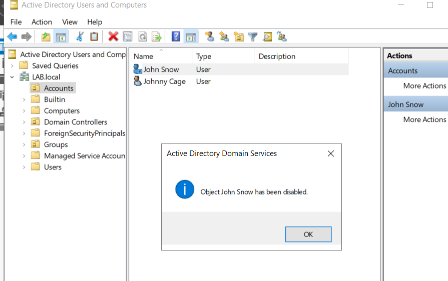
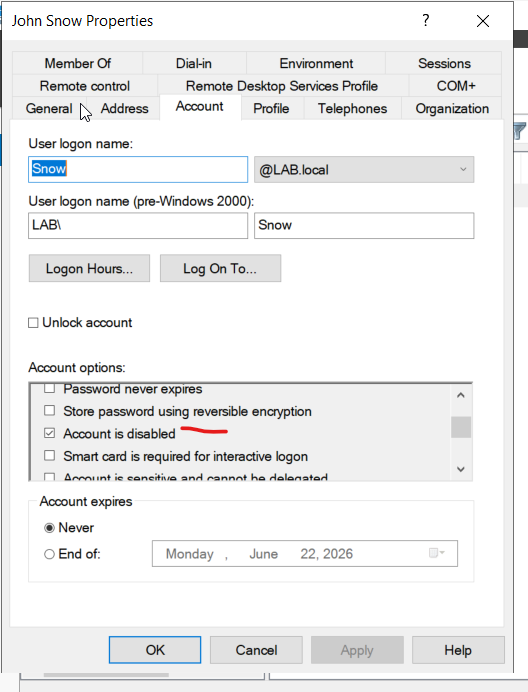

# Knowledge Base: Disabling and Offboarding User Accounts

## Objective
This guide outlines the standard operating procedure for disabling user accounts in Active Directory to secure corporate data during employee offboarding or security incidents.

## Scenario
The HR department submits a termination ticket for an employee, or the Security team requests an immediate account suspension due to a compromised device.

## Step-by-Step Resolution

### 1. Locate and Disable the Account
1. Open **Active Directory Users and Computers (ADUC)**.
2. Search for the target user or navigate to their departmental OU.
3. Right-click the user account and select **Disable Account**.
4. A confirmation dialog box will appear stating *"Object [User] has been disabled."*

  

### 2. Verify Account Status
1. Check the user icon in ADUC. A **small black downward-pointing arrow** will now appear over the user icon, indicating the account is inactive.
2. Under the user's **Properties > Account** tab, the option *"Account is disabled"* will now be checked.

  

## Security Best Practices Demonstrated
* **Immediate Revocation:** Prevented further interactive logons to the corporate domain.
* **Preservation:** Disabled the account rather than deleting it immediately, preserving file ownership and group memberships for audit purposes.
