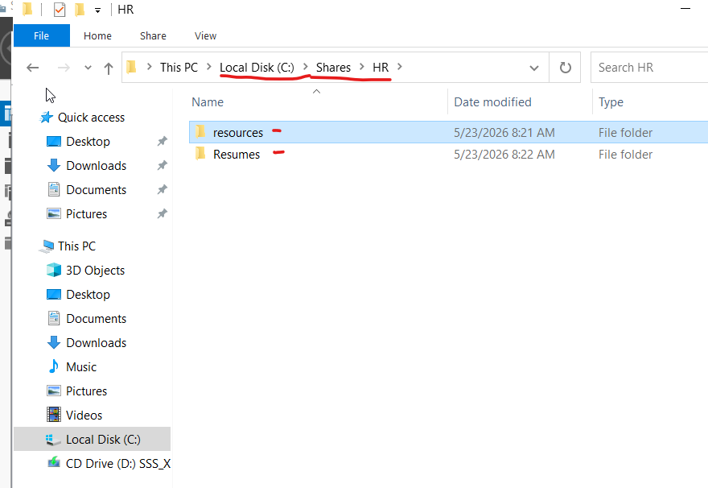
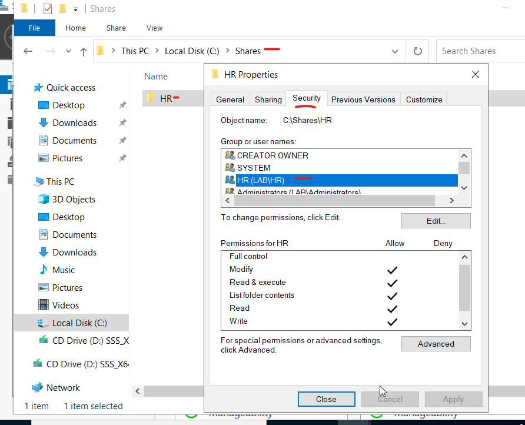
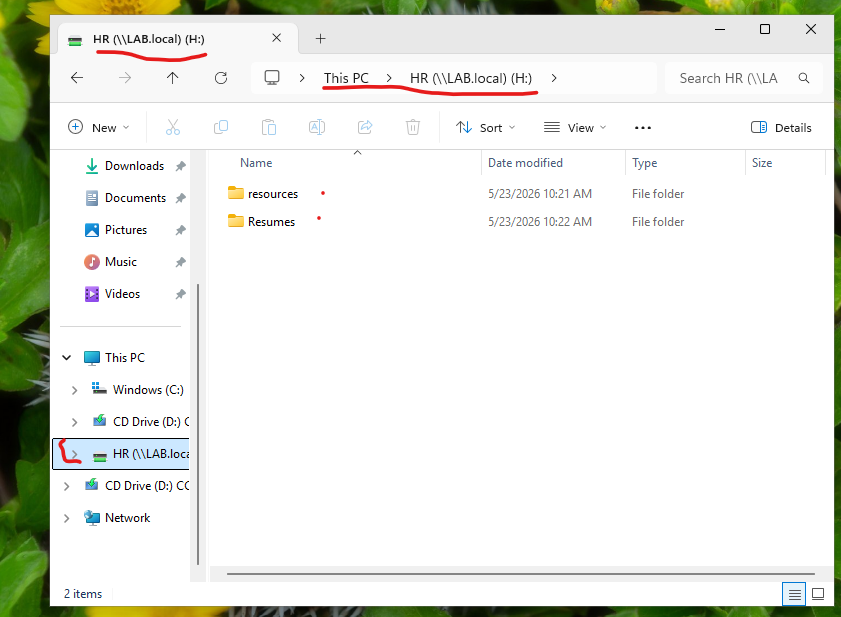

# Knowledge Base: Secure File Share Deployment and Network Drive Mapping

## Objective
This guide documents the creation of a centralized corporate file share on a Windows Server, configuration of explicit access controls, and the manual mapping of network drives on a Windows 11 client workstation.

## Scenario
The Human Resources department requires a secure, centralized location on the network to store sensitive operational files. The share must contain separated folders for general resources and candidate resumes, accessible only to verified HR personnel.

## Step-by-Step Implementation

### 1. Provisioning the Server Directory Structure
1. Connected to the Windows Server Domain Controller.
2. Created a root data directory on the storage drive named **`Shared`**.
3. Inside `Shared`, created a departmental folder named **`HR`**.
4. Inside the `HR` directory, created two functional sub-folders:
   * **`resumes`** (For candidate onboarding and recruitment data)
   * **`resources`** (For internal policy documents and forms)

  

### 2. Configuring Share and NTFS Permissions
1. Right-clicked the `HR` folder and opened **Properties > Sharing > Advanced Sharing**.
2. Checked **"Share this folder"** and set the Share Name to `HR`.
3. Adjusted **Share Permissions** to grant the `HR` Active Directory Security Group "Change" and "Read" access.
4. Configured **NTFS Security Permissions** to explicitly allow the `HR` security group access, while stripping inherited permissions from domain users to ensure strict data confidentiality.

  

### 3. Mapping the Network Drive on Windows 11
1. Logged into the Windows 11 client virtual machine as an authenticated HR department user.
2. Opened **File Explorer**, right-clicked **This PC**, and selected **Map network drive...**.
3. Configured the following parameters:
   * **Drive Letter:** `H:`
   * **Folder Path:** `\\<Server-IP-or-Name>\HR`
4. Verified that the `resumes` and `resources` folders appeared immediately and were fully interactive.

  

## Enterprise Concepts Demonstrated
* **Data Confidentiality:** Enforced strict data isolation so unauthorized personnel cannot browse or modify HR documentation.
* **Storage Centralization:** Simplified end-user workflows by presenting complex network paths as a familiar, single-letter local drive (`H:`).

