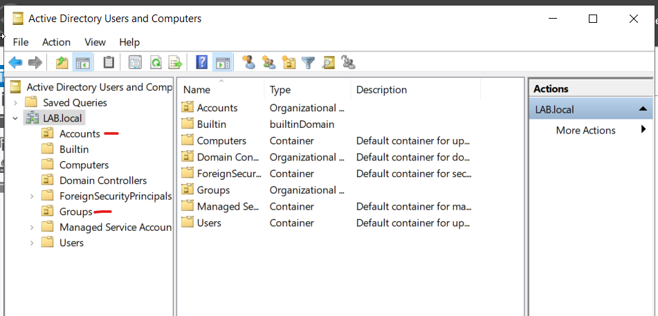
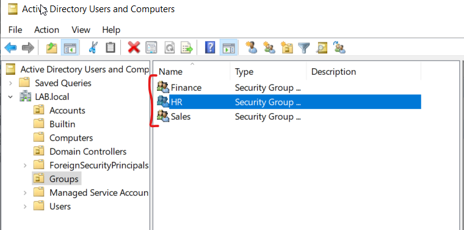
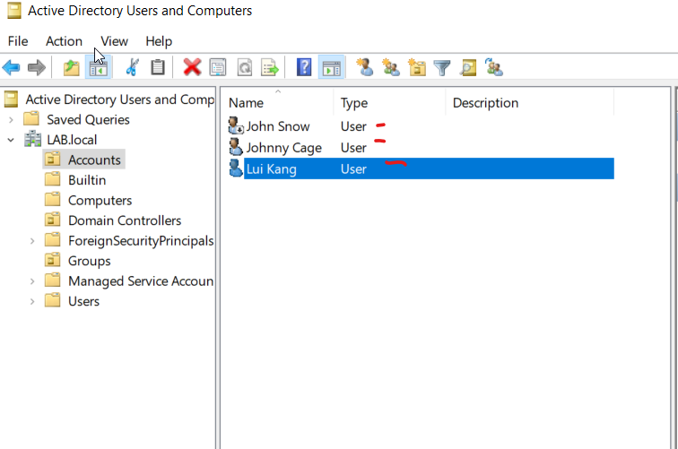

# Knowledge Base: User, Group, and OU Provisioning

## Objective
This guide documents the creation and structural organization of Organizational Units (OUs), Security Groups, and User Accounts within Active Directory Domain Services (AD DS).

## Scenario
The IT department must establish a clean, scalable directory architecture to manage a growing business. This setup isolates administrative controls by separating human identities from resource access groups.

## Step-by-Step Implementation

### 1. Creating the Dedicated OU Structure
1. Open **Active Directory Users and Computers (ADUC)**.
2. Right-clicked the domain root, hovered over **New**, and selected **Organizational Unit**.
3. Created two top-level, functional OUs:
   * **`accounts`**: Designated exclusively for holding employee user accounts.
   * **`Groups`**: Designated exclusively for holding security and distribution groups.

  
<!-- Replace with your OU structure screenshot filename -->

### 2. Provisioning Departmental Security Groups
1. Navigated to the **`Groups`** OU.
2. Right-clicked an empty space and selected **New > Group**.
3. Created three dedicated Global Security Groups to manage Role-Based Access Control (RBAC):
   * **`Sales`**
   * **`HR`**
   * **`Finance`**

  

### 3. Creating and Associating New Users
1. Navigated to the **`accounts`** OU.
2. Right-clicked an empty space and selected **New > User**.
3. Provisioned **three individual user accounts** with corporate-compliant temporary passwords.
4. Enabled **"User must change password at next logon"** on all accounts to enforce identity security.
5. Added each user to their corresponding security group inside the `Groups` OU (e.g., mapped a finance employee to the `Finance` group).

  

## Enterprise Benefits Demonstrated
* **Administrative Efficiency:** Separating accounts and groups makes targeting Group Policies (GPOs) and automating future management scripts much cleaner.
* **Least Privilege Access:** Utilizing explicit departmental groups ensures users only receive access to data relevant to their specific business role.
