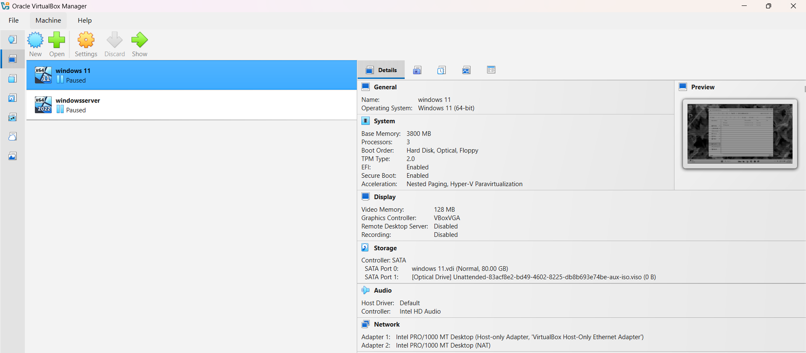

# Active Directory Lab Documentation

This folder contains the visual proof, configuration steps, and administration tasks completed within the local VirtualBox environment.

## Completed Tasks
* **User Provisioning:** Created standard user accounts and assigned them to specific departments.
* **Password Management:** Performed manual password resets and unlocked simulated user accounts.
* **Security Groups:** Created and managed security groups to control access to resources.
* 
* 
