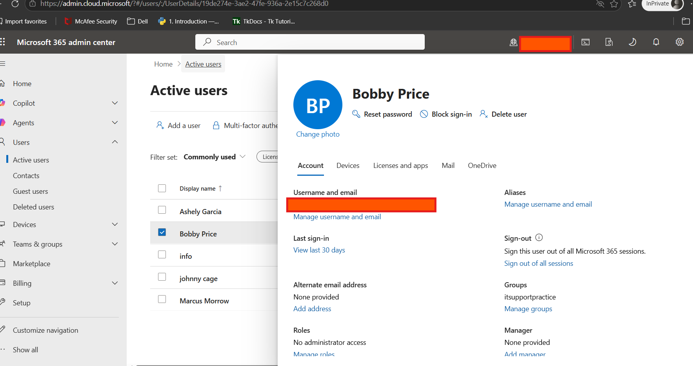

# Resetting a User Password in Microsoft 365

## Overview

This guide walks through how to reset a user's password in the Microsoft 365 Admin Center.

Password resets are one of the most common help desk requests and are typically needed when a user:

* Forgot their password
* Is locked out of their account
* Cannot sign in to Outlook, Teams, or the Microsoft 365 portal
* Needs a temporary password issued by IT

---

## Prerequisites

Before resetting a password, verify:

* You have access to the Microsoft 365 Admin Center
* Your account has permission to reset user passwords
* You have confirmed the user’s identity according to company policy

---

## Resetting the Password

### 1. Sign in to Microsoft 365 Admin Center

Open:

https://admin.microsoft.com

Sign in with your administrator account.

---

### 2. Navigate to Active Users

From the left-hand menu:

**Users** → **Active users**

This displays all user accounts in the tenant.

---

### 3. Select the User

Search for the affected user by:

* Name
* Username
* Email address

Click the user account to open the account details panel.

---

### 4. Reset Password

Inside the user panel:

Select:

**Reset password**

You will typically see two options:

* Auto-generate a password
* Create password manually

---

### 5. Require Password Change at Next Sign-In

Recommended:

☑ **Require this user to change their password when they first sign in**

This ensures the temporary password is replaced by the user immediately.

---

### 6. Save the New Password

Click:

**Reset password**

Copy the temporary password shown on screen.

Securely provide it to the user according to company policy.

---

## Post-Reset Verification

After resetting:

Verify the user can sign in successfully to:

* Outlook
* Teams
* OneDrive
* Microsoft 365 Portal

Recommended test:

https://portal.office.com

---

## Common Troubleshooting

### User still cannot sign in after password reset

Check:

* Caps Lock enabled
* Old saved credentials in browser
* Cached credentials in Outlook
* Incorrect username entered
* Account blocked from sign-in
* MFA prompt failing after password reset

---

### Outlook keeps prompting for password after reset

Possible fix:

* Sign out of Outlook
* Close Outlook completely
* Reopen Outlook
* Remove saved credentials from Windows Credential Manager if needed

---

### User changed password but apps still use old password

May require:

* Sign out and back in
* Lock/unlock workstation
* Restart device

---

## Notes

Good help desk practice during password resets:

* Verify user identity before resetting
* Never send passwords insecurely
* Require password change at next login whenever possible
* Confirm access is restored before closing the ticket

---

## Example Ticket Notes

```text
User unable to sign in to Microsoft 365 due to forgotten password.

Verified user identity.

Reset password in Microsoft 365 Admin Center and required password change at next sign-in.

Provided temporary password to user securely.

User successfully signed into portal.office.com and confirmed access restored.

Ticket resolved.
```

