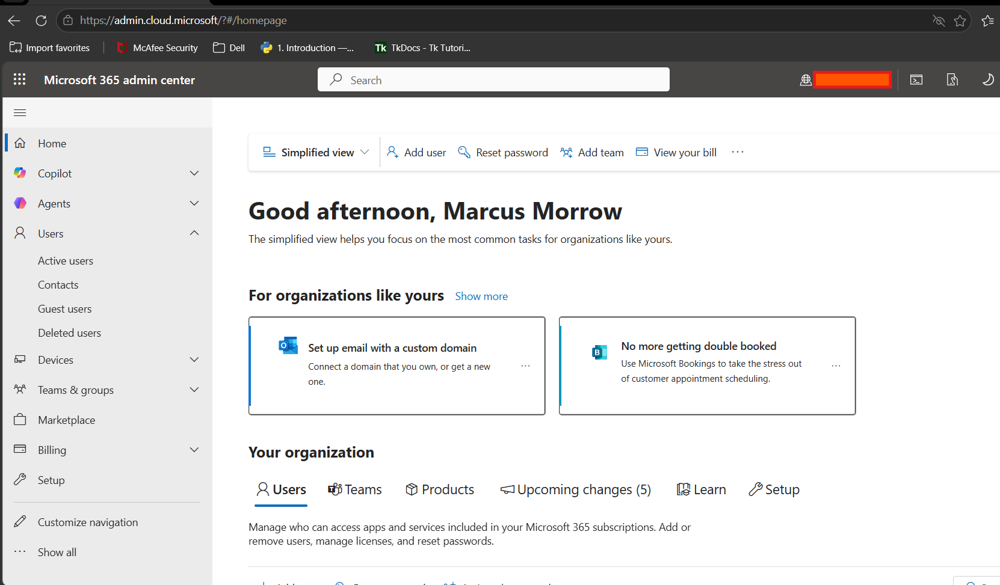
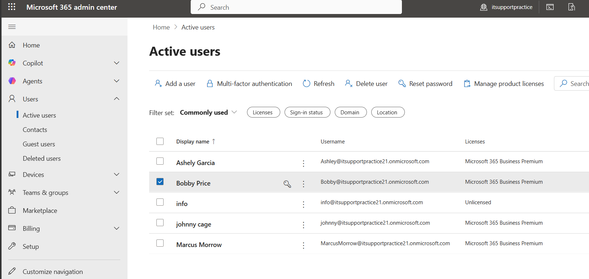

# Microsoft 365 Troubleshooting

## Overview

This folder contains practical Microsoft 365 help desk troubleshooting guides based on common support requests technicians handle in day-to-day IT environments.

The goal of this collection is to document repeatable troubleshooting steps for common Microsoft 365 issues while building hands-on familiarity with the Microsoft 365 Admin Center, user management, licensing, email administration, and end-user support workflows.

These guides are written as a personal lab and reference resource to practice common help desk scenarios and strengthen troubleshooting skills in a Microsoft 365 environment.

---

## Topics Covered

### Password Reset & Sign-In Issues

Common user account support requests including:

* Forgotten passwords
* Password resets
* Account access issues
* Login troubleshooting
* Temporary password issuance
* Forced password change at next sign-in

---

### Multi-Factor Authentication (MFA)

Common authentication-related troubleshooting such as:

* MFA enrollment
* Resetting MFA methods
* Re-registering authentication devices
* Microsoft Authenticator issues
* New phone/device migration
* Verification prompt troubleshooting

---

### Outlook Email Troubleshooting

Common email support issues including:

* Outlook not sending or receiving mail
* Password prompts
* Mailbox sync issues
* Search issues
* Outlook profile troubleshooting
* Cached credential problems

---

### Shared Mailbox Access

Mailbox access and permission management including:

* Creating shared mailboxes
* Assigning Full Access permissions
* Send As permissions
* Auto-mapping issues
* Mailbox visibility troubleshooting

---

### License Assignment

Microsoft 365 licensing administration including:

* Assigning licenses to users
* Removing licenses
* Modifying app access within licenses
* Troubleshooting missing service access

---

### OneDrive Troubleshooting

Common file sync issues including:

* OneDrive not syncing
* Sync conflicts
* Storage limit issues
* Sign-in problems
* Reconnecting OneDrive
* File restore basics

---

### Microsoft Teams Support

Collaboration and communication troubleshooting including:

* Sign-in issues
* Microphone or camera issues
* Teams cache problems
* Meeting access problems
* Missing teams or channels
* User communication issues

---

### User Onboarding

Common new-user provisioning tasks such as:

* Creating users
* Assigning licenses
* Initial password setup
* Group membership
* Mailbox setup
* Teams and OneDrive access

---

### User Offboarding

Common user deprovisioning tasks including:

* Blocking sign-in
* License removal
* Session revocation
* Mail forwarding
* Shared mailbox conversion
* Access cleanup

---

## Purpose

This folder serves as:

* a Microsoft 365 troubleshooting reference
* a hands-on help desk practice lab
* a documentation portfolio for common IT support workflows
* a knowledge base for repeatable ticket resolution steps

---

## Notes

These guides are intended for learning, lab practice, and documentation purposes based on common Microsoft 365 help desk workflows.

Troubleshooting steps may vary depending on:

* organization policies
* tenant configuration
* licensing level
* security settings
* conditional access policies
* administrative permissions

