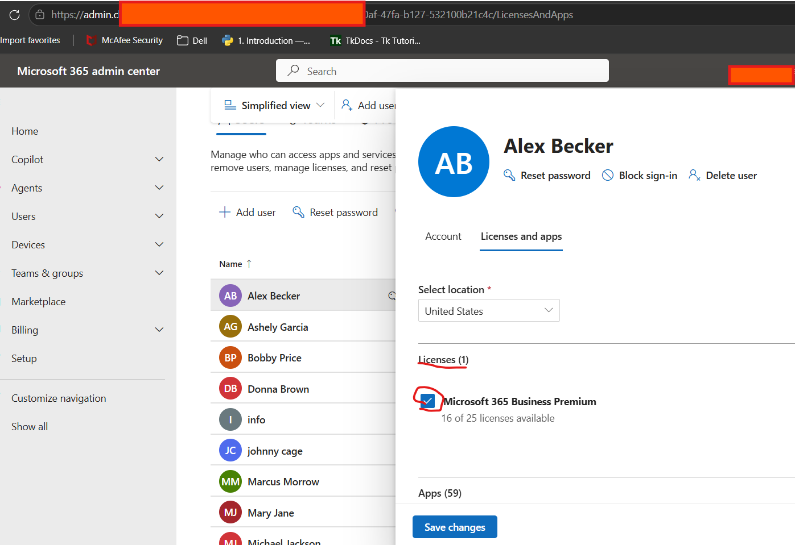

# License Assignment in Microsoft Entra ID - Troubleshooting Guide

## Overview

This guide documents the process of troubleshooting and resolving Microsoft 365 license assignment issues within Microsoft Entra ID.

Common scenarios include:

* User cannot access Microsoft 365 applications
* Outlook mailbox is not created
* Teams access is unavailable
* OneDrive is missing
* License assignment fails
* User receives "No license assigned" errors
* Newly created users cannot access services

---

# Ticket Information

### User Report

> I can't access Outlook.

or

> Teams says I don't have a license.

or

> I just received my account, but none of the Microsoft 365 apps work.

or

> I keep getting a message saying my organization hasn't assigned me a license.

---

# Step 1 - Gather Information from the User

Before making changes, collect information about the issue.

### Questions to Ask

#### User Information

* When was the account created?
* Has the account ever worked?
* What Microsoft 365 applications are affected?

#### Application Impact

* Can the user access Outlook?
* Can the user access Teams?
* Can the user access OneDrive?
* Can the user sign into Microsoft 365 at all?

#### Scope of Impact

* Is this affecting only one user?
* Are multiple users experiencing the same issue?
* Was the user recently onboarded?

#### Error Messages

Request screenshots or exact wording of any errors.

Common examples:

```text id="y2v0hb"
Your administrator has not assigned a license.
```

```text id="i25iqj"
You don't have access to this service.
```

```text id="x7cl2s"
No mailbox exists for this account.
```

---

# Information Gathered

### Example Findings

| Question              | Response |
| --------------------- | -------- |
| New employee?         | Yes      |
| Outlook working?      | No       |
| Teams working?        | No       |
| OneDrive working?     | No       |
| Other users affected? | No       |

### Initial Assessment

Because:

* Multiple Microsoft 365 services are unavailable
* User can authenticate successfully
* Account was recently created

The issue is likely related to licensing.

---

# Step 2 - Verify User Account Status

Sign into Microsoft Entra Admin Center.

Navigate to:

```text id="7qf3mb"
Identity → Users → All Users
```

Locate the user account.

Verify:

* Account is enabled
* User can sign in
* Account exists correctly

---

# Step 3 - Verify Assigned Licenses

Select the affected user.

Navigate to:

```text id="y1a8do"
Licenses
```

Review assigned licenses.

Examples:

* Microsoft 365 Business Basic
* Microsoft 365 Business Standard
* Microsoft 365 Business Premium
* Microsoft 365 E3
* Microsoft 365 E5

### Verify

At least one Microsoft 365 license should be assigned.

---

# Step 4 - Check Available License Inventory

Navigate to:

```text id="mdlymt"
Billing → Licenses
```

Verify:

* Available licenses exist.
* No subscription shortages exist.

Example issue:

```text id="u9xgjl"
Available licenses: 0
```

If all licenses are consumed, new assignments cannot be completed.

---

# Step 5 - Assign a License

Open the affected user.

Select:

```text id="xql0ut"
Licenses → Assignments
```

Choose the required license.

Example:

```text id="h6ejdh"
Microsoft 365 Business Premium
```

Save changes.

---

# Step 6 - Verify Service Plans

Within the assigned license, verify required services are enabled.

Examples include:

* Exchange Online
* Microsoft Teams
* OneDrive
* SharePoint Online

### Example Problem

A license may be assigned, but Exchange Online could be disabled.

Result:

```text id="0qggf8"
User has a license but no mailbox.
```

Enable required service plans as needed.

---

# Step 7 - Wait for Provisioning

After assigning the license:

Allow Microsoft 365 time to provision services.

Typical provisioning times:

```text id="3dx5ew"
5 minutes to 24 hours
```

depending on the service.

Most services appear within minutes.

---

# Step 8 - Verify Mailbox Creation

If Outlook is affected:

Navigate to:

```text id="6um4h6"
Exchange Admin Center
→ Recipients → Mailboxes
```

Verify:

* Mailbox exists.
* Mailbox status is healthy.

If no mailbox exists, wait for Exchange Online provisioning to complete.

---

# Step 9 - Test User Access

Ask the user to sign into:

```text id="jvfh0d"
https://portal.office.com
```

Verify access to:

* Outlook
* Teams
* OneDrive
* SharePoint

Confirm applications launch successfully.

---

# Step 10 - Verify Resolution

Confirm:

* User can sign in.
* Microsoft 365 applications are accessible.
* Mailbox is available.
* Teams functions normally.
* OneDrive is provisioned.

---

# Root Cause

The issue was caused by the user account not having a Microsoft 365 license assigned.

Without an active license, Microsoft 365 services such as Outlook, Teams, and OneDrive could not be provisioned.

---

# Resolution

The issue was resolved by:

1. Verifying license availability.
2. Assigning the appropriate Microsoft 365 license.
3. Confirming required service plans were enabled.
4. Waiting for service provisioning.

After provisioning completed, the user successfully accessed Microsoft 365 services.

---

# Alternative Root Causes

Common license assignment issues include:

* No license assigned
* License inventory exhausted
* Incorrect license assigned
* Service plans disabled
* Group-based licensing errors
* Delayed Microsoft 365 provisioning
* Account synchronization issues
* Duplicate licensing conflicts

# Skills Demonstrated

* User Interviewing and Ticket Intake
* Microsoft Entra ID Administration
* Microsoft 365 Licensing Management
* User Provisioning
* Exchange Online Administration
* Teams Administration
* OneDrive Provisioning
* Root Cause Analysis
* User Access Troubleshooting
* Help Desk Documentation
