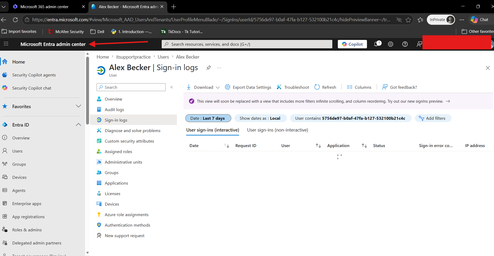

# Microsoft Entra ID Troubleshooting

## Overview

This folder contains troubleshooting guides for common Microsoft Entra ID issues encountered in Microsoft 365 environments. These guides focus on user account management, authentication, licensing, and identity-related problems that help desk technicians frequently support.

The goal of this collection is to provide structured troubleshooting procedures that help IT support professionals diagnose and resolve user access issues while maintaining security and minimizing downtime.

## Topics Covered

### Password Resets

Learn how to reset user passwords and restore account access when users forget their credentials or are unable to sign in. This guide covers account verification, password reset procedures, and post-reset validation.

### License Assignment

Learn how to assign, modify, and verify Microsoft 365 licenses for users. This guide covers identifying licensing issues, ensuring services are properly assigned, and validating access to Microsoft 365 applications.

### MFA Reset

Learn how to troubleshoot and reset Multi-Factor Authentication (MFA) settings when users lose access to authentication methods, replace devices, or experience sign-in issues. This guide covers authentication method management and account recovery procedures.

### Unblocking a User Account

Learn how to identify and resolve account lockouts and blocked sign-in scenarios. This guide covers investigating account status, restoring user access, and verifying successful authentication after remediation.

## Purpose

These guides are designed to help IT professionals develop a consistent troubleshooting methodology for Microsoft Entra ID issues. Each guide follows a structured approach that includes problem identification, information gathering, root cause analysis, resolution steps, validation, and user communication.

By understanding these common identity and access management scenarios, help desk technicians can improve their ability to support Microsoft 365 environments and provide effective assistance to end users.

