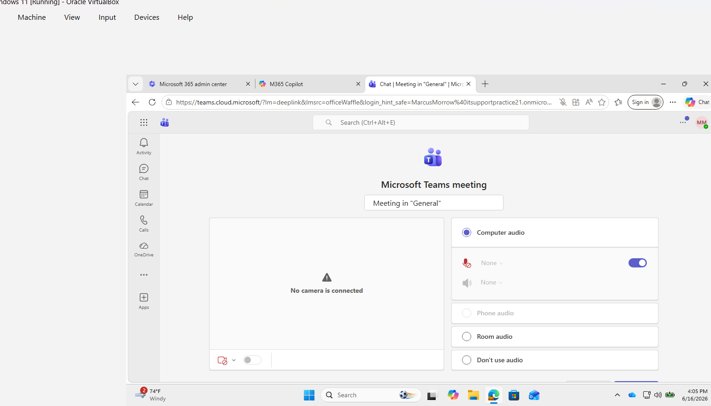
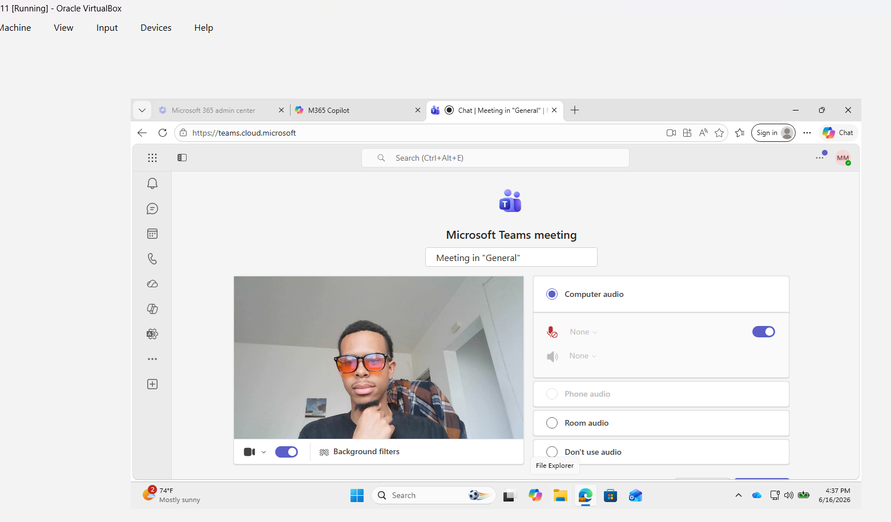

# Microsoft Teams – Camera Not Working




## Help Desk Troubleshooting Guide

### Ticket Example

**User Report:**

> "My camera isn't working in Teams."
>
> "People can't see me during meetings."
>
> "Teams says no camera detected."

---

# Objective

Determine why the user's camera is not functioning in Microsoft Teams and restore video functionality.

Common causes include:

* Camera disabled in Teams
* Incorrect camera selected
* Windows privacy settings blocking access
* Camera being used by another application
* Missing or corrupted drivers
* Hardware failure
* Teams application issues
* External webcam connection problems

---

# Information Gathering

Before troubleshooting, ask the user:

### Basic Questions

1. Is the camera built into the laptop or external?
2. Does the issue occur in:

   * All meetings
   * One meeting only
3. When did the issue start?
4. Have any changes been made recently?
5. Are you receiving an error message?
6. Does the camera work in other applications?

### Determine Scope

Ask:

> "Does the camera work in Zoom, Camera App, or other video applications?"

This helps determine if the issue is:

* Teams-specific
* Device-specific
* Hardware-related

---

# Step 1: Verify Camera Is Enabled in Teams

### Open Teams Settings

1. Open Microsoft Teams.
2. Click the three dots (**...**) in the upper-right corner.
3. Select:

Settings → Devices

### Verify Camera Selection

Under **Camera**:

* Confirm a camera is selected.
* If multiple cameras exist, test another option.

### Test Preview

Teams should display a live preview.

### Results

#### Preview Works

Camera is functioning.

Proceed to meeting-specific troubleshooting.

#### Preview Does Not Work

Continue with the next steps.

---

# Step 2: Verify Camera Is Not Disabled

Some laptops include:

* Physical privacy shutters
* Camera function keys
* Hardware switches

### Check For

* Webcam cover closed
* Privacy shutter enabled
* Function keys such as:

  * Fn + F8
  * Fn + F10
  * Manufacturer-specific camera toggle

### Test Again

Reopen Teams and check preview.

---

# Step 3: Test Camera in Windows

Determine whether Windows can access the camera.

### Open Camera App

1. Press Start.
2. Search:

Camera

3. Open the Camera application.

### Results

#### Camera Works

Hardware is functional.

Issue likely exists within Teams settings.

#### Camera Does Not Work

Issue is likely:

* Driver-related
* Permission-related
* Hardware-related

Continue troubleshooting.

---

# Step 4: Verify Camera Permissions

Windows privacy settings can block Teams.

### Open Privacy Settings

1. Open:

Settings → Privacy & Security → Camera

2. Verify:

* Camera access is ON
* Let apps access your camera is ON
* Microsoft Teams is allowed

### Test Teams Again

Restart Teams after making changes.

---

# Step 5: Check If Another Application Is Using the Camera

Only one application may control the camera in some situations.

### Close Applications Such As

* Zoom
* Google Meet
* Skype
* OBS Studio
* Camera App
* Browser tabs using video

### Reopen Teams

Test camera functionality.

---

# Step 6: Restart Microsoft Teams

Temporary application issues can prevent camera access.

### Fully Exit Teams

1. Right-click Teams in the system tray.
2. Select:

Quit

### Reopen Teams

Launch Teams and test video again.

---

# Step 7: Update Camera Drivers

Outdated drivers often cause video failures.

### Open Device Manager

1. Press:

Windows + X

2. Select:

Device Manager

3. Expand:

Cameras

or

Imaging Devices

### Update Driver

1. Right-click camera.
2. Select:

Update Driver

3. Choose:

Search Automatically

### Restart Computer

Retest Teams.

---

# Step 8: Reinstall Camera Driver

If updating fails:

### Remove Driver

1. Open Device Manager.
2. Right-click camera.
3. Select:

Uninstall Device

4. Restart computer.

Windows should reinstall the driver automatically.

---

# Step 9: Check Device Manager for Errors

Look for:

* Yellow warning icons
* Unknown devices
* Disabled camera devices

### If Disabled

1. Right-click device.
2. Select:

Enable Device

Retest Teams.

---

# Step 10: Test Teams Web Version

Determine whether issue is desktop-app specific.

### Test

1. Open browser.
2. Navigate to:

https://teams.microsoft.com

3. Join a meeting.

### Results

#### Camera Works in Browser

Issue likely involves:

* Teams desktop client
* Teams cache
* Local configuration

#### Camera Fails Everywhere

Issue likely involves:

* Windows
* Drivers
* Hardware

---

# Step 11: Clear Teams Cache

Corrupted Teams data can cause camera problems.

### Close Teams

Right-click Teams and select:

Quit

### Open Cache Location

Press:

Windows + R

Enter:

```text
%appdata%\Microsoft\Teams
```

Delete contents of:

* Cache
* databases
* GPUCache
* IndexedDB
* Local Storage
* tmp

### Restart Teams

Test camera functionality.

---

# Step 12: Reinstall Teams

If Teams remains unable to access the camera:

### Remove Teams

1. Open:

Settings → Apps

2. Uninstall:

   * Microsoft Teams
   * Teams Machine-Wide Installer

### Restart Computer

### Install Latest Version

Reinstall Teams and test again.

---

# Step 13: Test With Another User Account

Determine whether the issue follows:

* User profile
* Device

### Test

Sign into Teams with another account.

### Results

#### Other User Works

Issue may be profile-related.

#### Other User Fails

Issue is likely device-related.

---

# Step 14: Test External Webcam (If Available)

If using a laptop camera:

1. Connect USB webcam.
2. Select it in Teams.

### Results

#### External Webcam Works

Likely hardware issue with built-in camera.

#### External Webcam Also Fails

Likely software or permission issue.

---

# Quick Troubleshooting Flow

1. Verify camera selected in Teams.
2. Check physical camera switch/shutter.
3. Test Windows Camera App.
4. Verify camera permissions.
5. Close competing applications.
6. Restart Teams.
7. Update drivers.
8. Reinstall drivers.
9. Check Device Manager.
10. Test Teams Web App.
11. Clear Teams cache.
12. Reinstall Teams.
13. Test another account.

---

# Expected Outcome

By following this process, a help desk technician can identify whether the Teams camera issue is caused by:

* Incorrect Teams settings
* Privacy permissions
* Driver failures
* Camera conflicts
* Corrupted Teams cache
* Hardware issues
* Windows configuration problems

and restore video functionality for the user.

