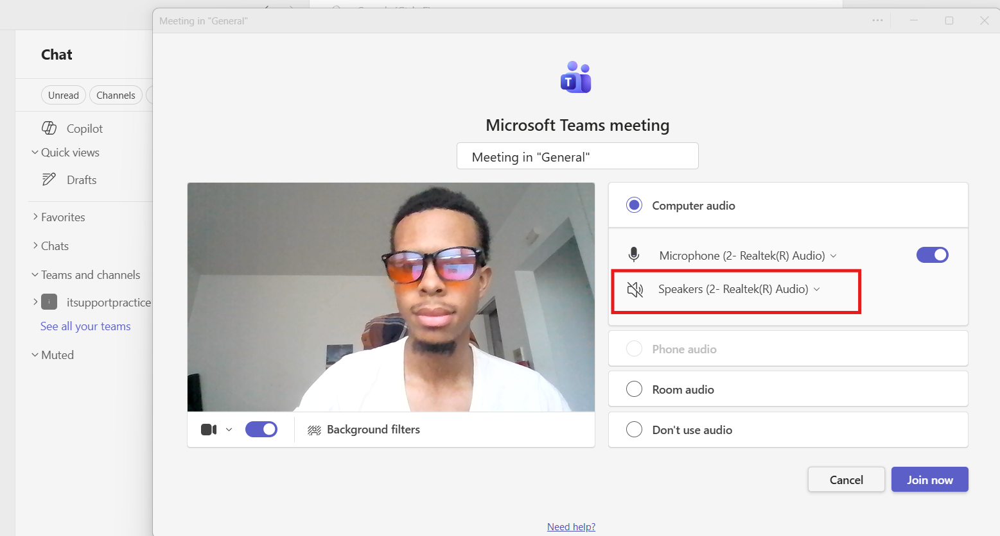

# Microsoft Teams – Meeting Audio Issues

## Help Desk Troubleshooting Guide

### Ticket Example

**User Report:**

> "I can't hear anyone during Teams meetings."
>
> "People can hear me, but I can't hear them."
>
> "The meeting audio keeps cutting out."
>
> "My speakers aren't working in Teams."

---

# Objective

Determine why meeting audio is not functioning properly in Microsoft Teams and restore audio functionality.

Common causes include:

* Incorrect speaker selected
* Volume muted in Teams or Windows
* Headset connection issues
* Bluetooth audio problems
* Audio driver issues
* Teams device configuration problems
* Network instability
* Corrupted Teams cache

---

# Information Gathering

Before troubleshooting, ask the user:

### Basic Questions

1. What exactly is happening?

   * Cannot hear anyone
   * Others cannot hear you
   * Audio cuts in and out
   * Audio sounds distorted

2. Are you using:

   * Laptop speakers
   * USB headset
   * Bluetooth headset
   * External speakers

3. Does the issue occur:

   * In all meetings
   * In one specific meeting

4. When did the issue start?

5. Have any changes been made recently?

6. Does audio work in other applications?

### Determine Scope

Ask:

> "Can you hear audio from YouTube, Zoom, or other applications?"

This helps determine if the issue is:

* Teams-specific
* Device-specific
* Hardware-related

---

# Step 1: Verify Teams Audio Device Selection

### Open Teams Settings

1. Open Microsoft Teams.
2. Click the three dots (**...**) in the upper-right corner.
3. Select:

Settings → Devices

### Verify Speaker Selection

Under **Speaker**:

* Confirm the correct audio device is selected.
* Test alternate devices if available.

### Verify Microphone Selection

Under **Microphone**:

* Confirm the correct microphone is selected.

### Test Devices

Use the built-in test call feature if available.

---

# Step 2: Verify Volume Levels

### Check Windows Volume

1. Click the speaker icon in the taskbar.
2. Confirm volume is not muted.
3. Increase volume level.

### Check Teams Volume

1. Right-click speaker icon.
2. Select:

Volume Mixer

3. Verify Teams volume is not muted.

### Test Again

Join a meeting and verify audio.

---

# Step 3: Verify User Is Connected to Meeting Audio

Sometimes users join without connecting audio.

### During Meeting

Select:

Join Audio

or

Connect Audio

Verify audio is connected successfully.

---

# Step 4: Test Audio Outside Teams

Determine whether Windows audio is functioning.

### Test Speaker Output

1. Open YouTube or another media source.
2. Play audio.

### Results

#### Audio Works

Issue likely exists within Teams.

#### Audio Does Not Work

Issue likely involves:

* Audio device
* Drivers
* Windows settings

---

# Step 5: Verify Audio Output Device

### Open Sound Settings

1. Right-click speaker icon.
2. Select:

Sound Settings

### Verify Output Device

Ensure the correct device is selected.

Examples:

* Laptop Speakers
* USB Headset
* Bluetooth Headset
* Docking Station Audio

### Test Device

Use Windows test feature.

---

# Step 6: Check Bluetooth Devices

Bluetooth devices frequently switch between audio profiles.

### Verify

1. Bluetooth headset is connected.
2. Battery level is adequate.
3. Correct device is selected in Teams and Windows.

### Test

Switch to another audio device to isolate the issue.

---

# Step 7: Disconnect and Reconnect Audio Device

### USB Devices

1. Disconnect headset.
2. Wait 10 seconds.
3. Reconnect device.

### Bluetooth Devices

1. Disconnect Bluetooth device.
2. Reconnect.
3. Verify Teams recognizes the device.

### Test Again

Join a meeting and verify audio.

---

# Step 8: Restart Microsoft Teams

Temporary application issues can affect audio.

### Fully Close Teams

1. Right-click Teams in the system tray.
2. Select:

Quit

### Relaunch Teams

Open Teams and test audio.

---

# Step 9: Verify Audio Permissions

### Open Privacy Settings

1. Open:

Settings → Privacy & Security → Microphone

2. Verify:

* Microphone access is ON
* Apps are allowed to use microphone
* Microsoft Teams is allowed

### Test Again

Restart Teams after making changes.

---

# Step 10: Update Audio Drivers

Outdated drivers can cause meeting audio issues.

### Open Device Manager

1. Press:

Windows + X

2. Select:

Device Manager

3. Expand:

* Audio Inputs and Outputs
* Sound, Video and Game Controllers

### Update Driver

1. Right-click audio device.
2. Select:

Update Driver

3. Choose:

Search Automatically

### Restart Computer

Retest Teams.

---

# Step 11: Reinstall Audio Drivers

If updates fail:

### Remove Driver

1. Open Device Manager.
2. Right-click audio device.
3. Select:

Uninstall Device

4. Restart computer.

Windows should reinstall the driver automatically.

---

# Step 12: Test Teams Web Version

Determine whether the issue is specific to the desktop client.

### Test

1. Open browser.
2. Navigate to:

https://teams.microsoft.com

3. Join a meeting.

### Results

#### Audio Works

Issue likely exists with Teams desktop application.

#### Audio Fails

Issue likely exists within:

* Windows
* Audio hardware
* Drivers

---

# Step 13: Clear Teams Cache

Corrupted Teams cache can affect audio functionality.

### Close Teams

Right-click Teams and select:

Quit

### Open Cache Location

Press:

Windows + R

Enter:

```text
%appdata%\Microsoft\Teams
```

Delete contents of:

* Cache
* databases
* GPUCache
* IndexedDB
* Local Storage
* tmp

### Restart Teams

Retest meeting audio.

---

# Step 14: Reinstall Teams

If audio issues continue:

### Remove Teams

1. Open:

Settings → Apps

2. Uninstall:

   * Microsoft Teams
   * Teams Machine-Wide Installer

### Restart Computer

### Install Latest Version

Reinstall Teams and test again.

---

# Step 15: Test Another Audio Device

If available:

### Test With

* USB headset
* Wired headset
* External speakers
* Laptop speakers

### Results

#### New Device Works

Issue likely involves original audio hardware.

#### New Device Fails

Issue likely involves software or configuration.

---

# Step 16: Check Network Stability

Poor network quality can affect meeting audio.

### Test Connection

1. Run:

```cmd
ping google.com -t
```

2. Monitor for:

   * High latency
   * Packet loss
   * Connection drops

### Results

#### Stable Connection

Continue troubleshooting locally.

#### Unstable Connection

Investigate:

* Wi-Fi signal
* VPN connection
* ISP issues
* Network congestion

---

# Quick Troubleshooting Flow

1. Verify Teams speaker and microphone selection.
2. Check Windows and Teams volume levels.
3. Verify meeting audio connection.
4. Test audio outside Teams.
5. Verify Windows output device.
6. Check Bluetooth devices.
7. Reconnect audio device.
8. Restart Teams.
9. Verify microphone permissions.
10. Update audio drivers.
11. Reinstall audio drivers.
12. Test Teams Web App.
13. Clear Teams cache.
14. Reinstall Teams.
15. Test another audio device.
16. Check network stability.

---

# Expected Outcome

By following this process, a help desk technician can identify whether Teams meeting audio issues are caused by:

* Incorrect audio device selection
* Muted volume controls
* Bluetooth device conflicts
* Driver failures
* Permission issues
* Corrupted Teams cache
* Hardware failures
* Network instability
* Teams configuration problems

and restore proper audio functionality for the user.
