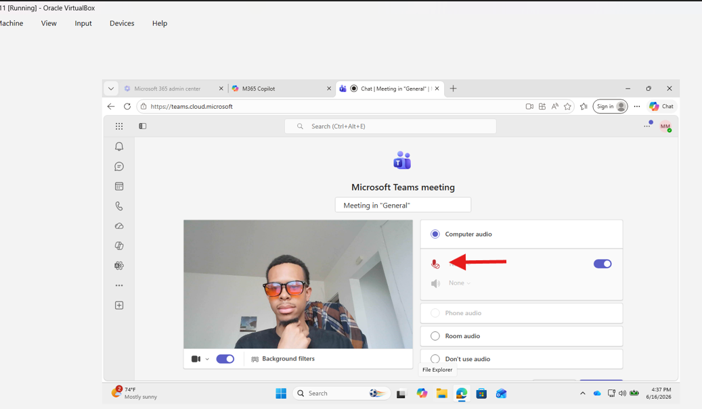
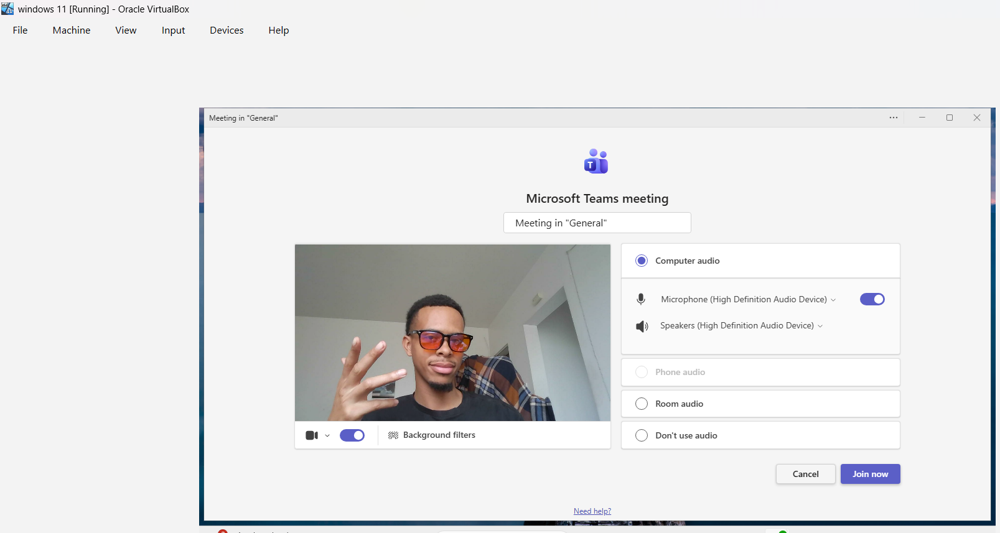
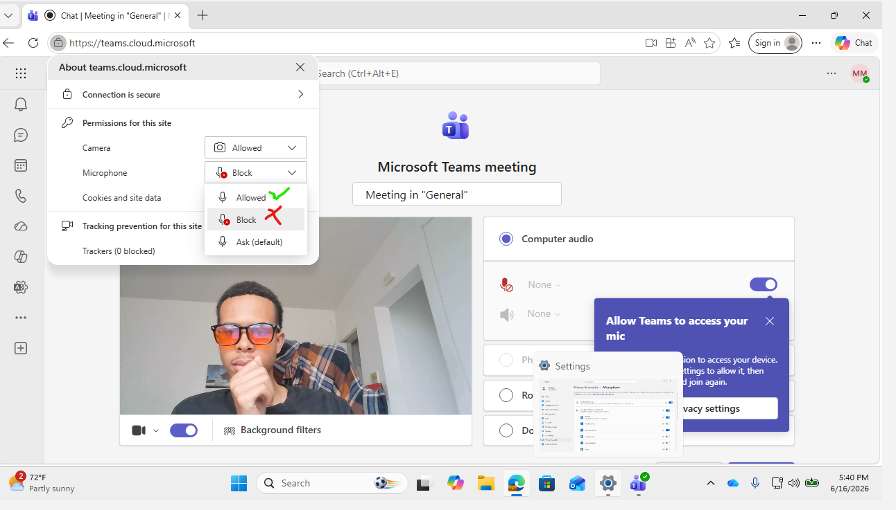

# Microsoft Teams – Microphone Not Working



## Help Desk Troubleshooting Guide

### Ticket Example

**User Report:**

> "Nobody can hear me in Teams."
>
> "My microphone isn't working during meetings."
>
> "Teams says no microphone detected."

---

# Objective

Determine why the user's microphone is not functioning in Microsoft Teams and restore audio input functionality.

Common causes include:

* Microphone muted in Teams
* Incorrect microphone selected
* Windows privacy settings blocking microphone access
* Microphone being used by another application
* Missing or corrupted audio drivers
* Hardware failure
* Teams application issues
* Headset connection problems

---

# Information Gathering

Before troubleshooting, ask the user:

### Basic Questions

1. Are you using:

   * Built-in laptop microphone
   * USB headset
   * Bluetooth headset
   * External microphone

2. Does the issue occur:

   * In all meetings
   * In one specific meeting

3. When did the issue start?

4. Have any changes been made recently?

5. Are you receiving any error messages?

6. Can other people hear you in other applications?

### Determine Scope

Ask:

> "Does your microphone work in Zoom, Discord, the Voice Recorder app, or other applications?"

This helps determine if the issue is:

* Teams-specific
* Device-specific
* Hardware-related

---

# Step 1: Verify Microphone Is Enabled in Teams

### Open Teams Settings

1. Open Microsoft Teams.
2. Click the three dots (**...**) in the upper-right corner.
3. Select:

Settings → Devices

### Verify Microphone Selection

Under **Microphone**:

* Confirm a microphone is selected.
* If multiple devices exist, test another microphone.

### Test Microphone

Speak into the microphone.

Verify the audio level indicator moves.

### Results

#### Audio Meter Responds

Microphone is working.

Proceed to meeting-specific troubleshooting.

#### Audio Meter Does Not Respond

Continue with the next steps.

---

# Step 2: Verify User Is Not Muted

### During a Meeting

Check if the microphone icon shows:

* Microphone enabled
* Not muted

Ask the user to unmute manually.

### Test Again

Speak into the microphone and verify other participants can hear audio.

---

# Step 3: Check Physical Microphone Controls

Some devices include:

* Mute buttons
* Inline headset controls
* Keyboard function keys

### Check For

* Headset mute switch
* Keyboard mute button
* Function keys such as:

  * Fn + F4
  * Fn + F8
  * Manufacturer-specific mute controls

### Test Again

Verify the microphone is no longer muted.

---

# Step 4: Test Microphone in Windows

Determine whether Windows can access the microphone.

### Open Sound Recorder

1. Press Start.
2. Search:

Sound Recorder

or

Voice Recorder

3. Record a short message.
4. Play it back.

### Results

#### Recording Works

Hardware is functioning.

Issue likely exists within Teams.

#### Recording Fails

Issue is likely:

* Driver-related
* Permission-related
* Hardware-related

Continue troubleshooting.

---

# Step 5: Verify Microphone Permissions

Windows privacy settings can block Teams.

### Open Privacy Settings

1. Open:

Settings → Privacy & Security → Microphone

2. Verify:

* Microphone access is ON
* Let apps access your microphone is ON
* Microsoft Teams is allowed

### Test Teams Again

Restart Teams after making changes.

---

# Step 6: Check If Another Application Is Using the Microphone

Applications can sometimes take control of audio devices.

### Close Applications Such As

* Zoom
* Discord
* Skype
* OBS Studio
* Voice Recorder
* Browser tabs using audio

### Reopen Teams

Test microphone functionality.

---

# Step 7: Verify Windows Input Device

### Open Sound Settings

1. Right-click the speaker icon.
2. Select:

Sound Settings

3. Under **Input**, verify:

* Correct microphone selected
* Input volume is adequate

### Test Device

Use the built-in microphone test.

Verify Windows detects audio.

---

# Step 8: Update Audio Drivers

Outdated drivers often cause microphone failures.

### Open Device Manager

1. Press:

Windows + X

2. Select:

Device Manager

3. Expand:

Audio Inputs and Outputs

and

Sound, Video and Game Controllers

### Update Driver

1. Right-click audio device.
2. Select:

Update Driver
3. Choose:

Search Automatically

### Restart Computer

Retest Teams.

---

# Step 9: Reinstall Audio Drivers

If updating fails:

### Remove Driver

1. Open Device Manager.
2. Right-click audio device.
3. Select:

Uninstall Device

4. Restart computer.

Windows should reinstall the driver automatically.

---

# Step 10: Check Bluetooth Devices

Bluetooth headsets frequently cause microphone issues.

### Verify

1. Bluetooth device is connected.
2. Battery is charged.
3. Correct microphone is selected in Teams.

### Test Again

Switch between:

* Laptop microphone
* Bluetooth microphone

to isolate the issue.

---

# Step 11: Test Teams Web Version

Determine whether issue is desktop-app specific.

### Test

1. Open browser.
2. Navigate to:

https://teams.microsoft.com

3. Join a meeting.

4. Allow microphone access when prompted.

### Results

#### Microphone Works in Browser

Issue likely involves:

* Teams desktop client
* Teams cache
* Local configuration

#### Microphone Fails Everywhere

Issue likely involves:

* Windows
* Drivers
* Hardware

---

# Step 12: Clear Teams Cache

Corrupted Teams data can cause microphone problems.

### Close Teams

Right-click Teams and select:

Quit

### Open Cache Location

Press:

Windows + R

Enter:

```text
%appdata%\Microsoft\Teams
```

Delete contents of:

* Cache
* databases
* GPUCache
* IndexedDB
* Local Storage
* tmp

### Restart Teams

Test microphone functionality.

---

# Step 13: Reinstall Teams

If Teams remains unable to access the microphone:

### Remove Teams

1. Open:

Settings → Apps

2. Uninstall:

   * Microsoft Teams
   * Teams Machine-Wide Installer

### Restart Computer

### Install Latest Version

Reinstall Teams and test again.

---

# Step 14: Test With Another User Account

Determine whether the issue follows:

* User profile
* Device

### Test

Sign into Teams with another account.

### Results

#### Other User Works

Issue may be profile-related.

#### Other User Fails

Issue is likely device-related.

---

# Step 15: Test Another Microphone

If available:

1. Connect a USB headset.
2. Connect an external microphone.
3. Select the new device in Teams.

### Results

#### New Microphone Works

Likely issue with original microphone hardware.

#### New Microphone Fails

Likely software, driver, or configuration issue.

---

# Quick Troubleshooting Flow

1. Verify microphone selected in Teams.
2. Confirm user is not muted.
3. Check physical mute controls.
4. Test Voice Recorder.
5. Verify microphone permissions.
6. Close competing applications.
7. Verify Windows input device.
8. Update audio drivers.
9. Reinstall audio drivers.
10. Check Bluetooth devices.
11. Test Teams Web App.
12. Clear Teams cache.
13. Reinstall Teams.
14. Test another account.
15. Test another microphone.

---

# Expected Outcome

By following this process, a help desk technician can identify whether the Teams microphone issue is caused by:

* Incorrect Teams settings
* Muted devices
* Privacy permissions
* Audio device conflicts
* Driver failures
* Bluetooth issues
* Corrupted Teams cache
* Hardware problems
* Windows configuration issues

and restore microphone functionality for the user.

