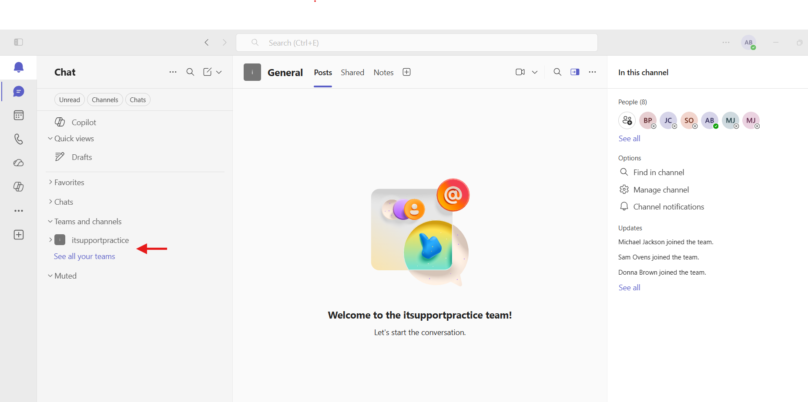
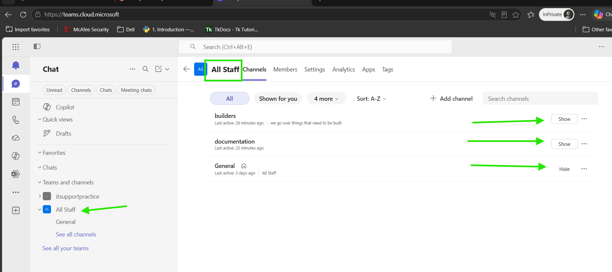

# Microsoft Teams – Missing Teams or Channels


## Help Desk Troubleshooting Guide

### Ticket Example

**User Report:**

> "A Team I used to access is missing."
>
> "One of my channels disappeared."
>
> "I can't find my department Team anymore."
>
> "My coworker can see the Team, but I can't."

---

# Objective

Determine why a Team or Channel is missing in Microsoft Teams and restore user access.

Common causes include:

* User removed from Team membership
* Channel hidden by the user
* Team archived
* Team deleted
* Sync issues within Teams
* Permission changes
* Private channel membership issues
* Microsoft Teams cache problems

---

# Information Gathering

Before troubleshooting, ask the user:

### Basic Questions

1. What Team or Channel is missing?
2. When was it last accessible?
3. Is the entire Team missing or only a channel?
4. Do other users still see it?
5. Has the user recently changed departments or groups?
6. Is the missing item:

   * Standard Channel
   * Private Channel
   * Shared Channel

### Determine Scope

Ask:

> "Can any of your coworkers still access the Team or Channel?"

This helps determine if the issue is:

* User-specific
* Permission-related
* Organization-wide

---

# Step 1: Verify the User Is Looking in the Correct Location

Sometimes Teams or channels become hidden.

### Check Team List

1. Open Microsoft Teams.
2. Select:

Teams

3. Scroll through the Team list.

### Check Hidden Teams

1. Expand:

Hidden Teams

2. Look for the missing Team.

### Results

#### Team Found

Unhide the Team.

#### Team Not Found

Continue troubleshooting.

---

# Step 2: Verify Hidden Channels

Channels can be hidden without being deleted.

### Within the Team

1. Expand the Team.
2. Select:

See All Channels

or

View Channels

3. Verify the missing channel appears.

### Results

#### Channel Found

Select:

Show

#### Channel Not Found

Continue troubleshooting.

---

# Step 3: Verify Team Membership

The user may have been removed from the Team.

### Check Membership

1. Open Teams Admin Center or Team management.
2. Locate the Team.
3. Verify the user appears as:

   * Member
   * Owner

### Results

#### User Missing

Re-add user to the Team.

#### User Present

Continue troubleshooting.

---

# Step 4: Verify Microsoft 365 Group Membership

Many Teams are backed by Microsoft 365 Groups.

### Microsoft 365 Admin Center

1. Navigate to:

Teams & Groups → Active Teams & Groups

2. Locate the associated group.

3. Verify user membership.

### Results

#### User Missing

Add the user to the group.

Allow time for synchronization.

#### User Present

Continue troubleshooting.

---

# Step 5: Verify Private Channel Membership

Private channels have separate permissions.

### Check Channel Membership

1. Open Team management.
2. Locate the private channel.
3. Review channel members.

### Results

#### User Missing

Add user to the private channel.

#### User Present

Continue troubleshooting.

---

# Step 6: Verify Shared Channel Membership

Shared channels maintain separate permissions from the parent Team.

### Review Shared Channel Access

1. Open Team management.
2. Locate the shared channel.
3. Verify membership.

### Results

#### User Missing

Add user to the shared channel.

#### User Present

Continue troubleshooting.

---

# Step 7: Verify Team Has Not Been Archived

Archived Teams remain accessible but can appear inactive.

### Check Team Status

1. Open Teams Admin Center.
2. Navigate to:

Teams → Manage Teams

3. Locate the Team.

### Results

#### Team Archived

Unarchive if appropriate.

#### Team Active

Continue troubleshooting.

---

# Step 8: Verify Team Has Not Been Deleted

Deleted Teams disappear from users.

### Check Deleted Groups

1. Open Microsoft 365 Admin Center.
2. Navigate to:

Teams & Groups → Deleted Groups

3. Search for the Team.

### Results

#### Team Found

Restore the Team.

#### Team Not Found

Continue troubleshooting.

---

# Step 9: Sign Out and Back Into Teams

Synchronization issues can prevent Teams from displaying correctly.

### Sign Out

1. Select profile picture.
2. Choose:

Sign Out

### Sign Back In

1. Restart Teams.
2. Sign in again.

### Verify

Check whether the Team or channel reappears.

---

# Step 10: Test Teams Web Version

Determine whether the issue is specific to the desktop client.

### Test

1. Open browser.
2. Navigate to:

https://teams.microsoft.com

3. Sign in.

### Results

#### Team Appears

Issue likely exists with desktop application synchronization.

#### Team Missing

Issue likely involves permissions or membership.

---

# Step 11: Clear Teams Cache

Corrupted cache can prevent Teams and channels from appearing.

### Close Teams

1. Right-click Teams in the system tray.
2. Select:

Quit

### Open Cache Location

Press:

Windows + R

Enter:

```text
%appdata%\Microsoft\Teams
```

Delete contents of:

* Cache
* databases
* GPUCache
* IndexedDB
* Local Storage
* tmp

### Restart Teams

Verify whether the Team or channel returns.

---

# Step 12: Verify Teams Client Is Updated

Outdated clients can cause synchronization problems.

### Check For Updates

1. Open Teams.
2. Select:

Settings and More (...)

3. Choose:

Check for Updates

### Restart Teams

Verify results.

---

# Step 13: Test Another Device

Determine whether the issue follows the user or the device.

### Test

1. Sign into Teams on another computer.
2. Verify Team visibility.

### Results

#### Team Appears

Issue is likely device-related.

#### Team Missing

Issue is likely account-related.

---

# Step 14: Verify Team Permissions

Changes to Team ownership or permissions can affect visibility.

### Check Team Settings

Review:

* Team owners
* Membership settings
* Channel permissions

### Verify

Ensure the user has proper access rights.

---

# Step 15: Reinstall Teams

If synchronization issues continue:

### Remove Teams

1. Open:

Settings → Apps

2. Uninstall:

   * Microsoft Teams
   * Teams Machine-Wide Installer

### Restart Computer

### Install Latest Version

Reinstall Teams and test again.

---

# Quick Troubleshooting Flow

1. Check Hidden Teams.
2. Check Hidden Channels.
3. Verify Team membership.
4. Verify Microsoft 365 Group membership.
5. Verify Private Channel membership.
6. Verify Shared Channel membership.
7. Check if Team is archived.
8. Check if Team is deleted.
9. Sign out and back into Teams.
10. Test Teams Web App.
11. Clear Teams cache.
12. Update Teams.
13. Test another device.
14. Verify Team permissions.
15. Reinstall Teams.

---

# Expected Outcome

By following this process, a help desk technician can identify whether missing Teams or Channels are caused by:

* Hidden Teams or channels
* Removed membership
* Private or shared channel permissions
* Archived Teams
* Deleted Teams
* Synchronization issues
* Corrupted Teams cache
* Permission changes
* Client-related issues

and restore visibility and access for the user.

