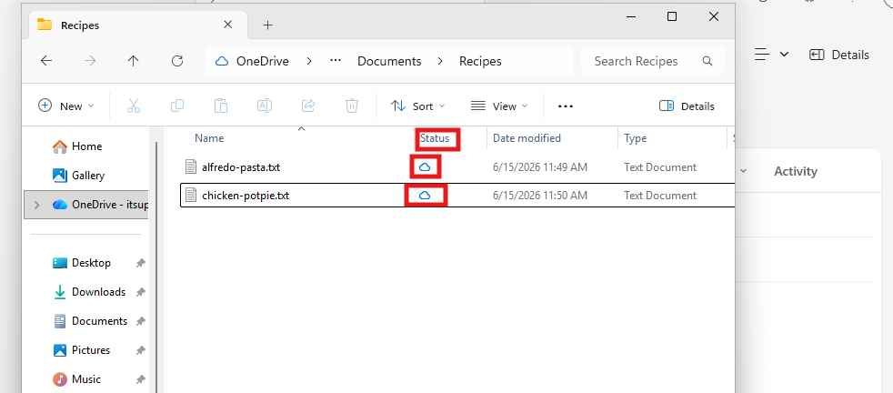
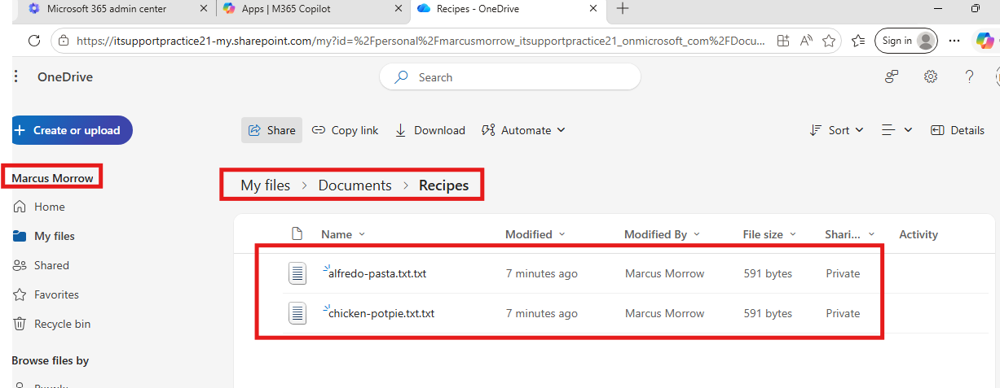
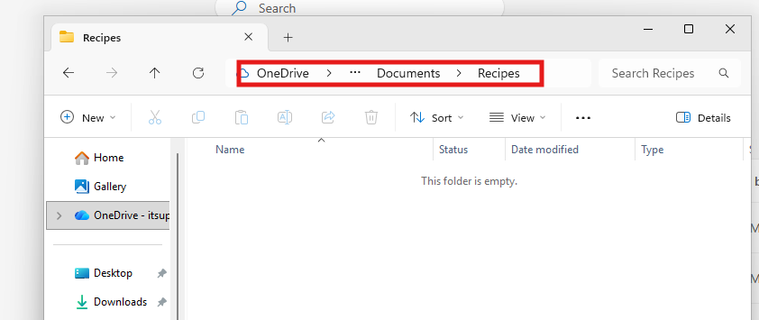
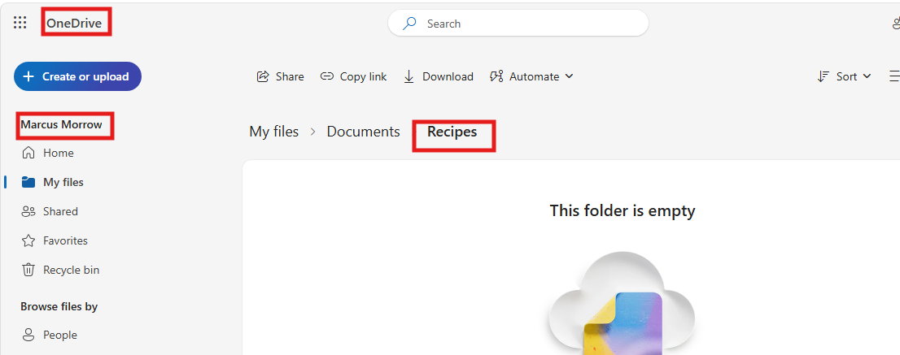
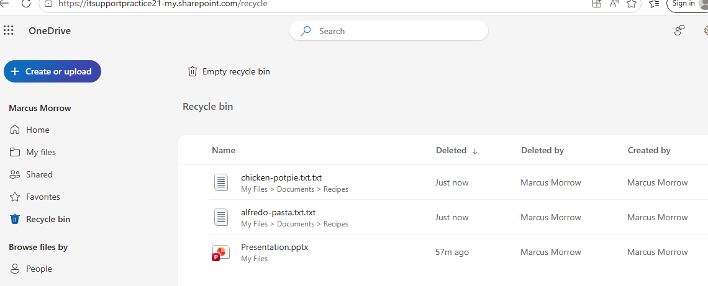

# Microsoft 365 Help Desk Ticket: Files Missing After OneDrive Sync


## Ticket Summary

**Issue:** User reports files are missing from OneDrive after synchronization.

**User Complaint:**

> "Several files disappeared from my OneDrive folder. I know they were there yesterday, but now I can't find them."

**Service:** Microsoft OneDrive for Business
**Environment:** Microsoft 365 / Windows 10 or Windows 11
**Ticket Type:** Missing Files / Data Recovery
**Priority:** High



---

# 1. Gather Information from the User

Before making changes, gather as much information as possible.

## Questions to Ask

* Which files are missing?
* When were the files last seen?
* Were the files stored in OneDrive, Desktop, Documents, or another folder?
* Were any files recently moved or renamed?
* Did the user delete anything recently?
* Are the files missing on all devices or only one device?
* Can the files be found in OneDrive Online?
* Has anyone else been working in the shared folder?

---

# 2. Determine the Scope of the Issue

The first goal is to determine whether the files are:

* Deleted
* Moved
* Renamed
* Stored in another location
* Hidden by sync issues

## Verify the User's OneDrive Account

1. Open OneDrive Online.
2. Sign in using the user's Microsoft 365 account.
3. Navigate to the folder where the files should exist.

### Expected Result

If the files appear online but not locally, the issue is likely a sync problem.

If the files are missing online as well, continue with recovery steps.

---

# 3. Search for the Missing Files

Users frequently move or rename files accidentally.

## Search Using OneDrive Online

1. Open OneDrive Online.
2. Use the Search bar.
3. Search by:

   * File name
   * Partial file name
   * File type

### Examples

```text
Budget
.xlsx
Proposal
```

## Search Locally

1. Open File Explorer.
2. Open the OneDrive folder.
3. Use the Search box.
4. Search for the missing file.

### Expected Result

If found, determine whether the file was moved or renamed.

---

# 4. Check the OneDrive Recycle Bin

Many missing file incidents are accidental deletions.

## Recovery Steps

1. Open OneDrive Online.
2. Select **Recycle Bin** from the left menu.
3. Search for the missing file.
4. Select the file.
5. Click **Restore**.

### Expected Result

The file returns to its original location.

---

# 5. Check the Windows Recycle Bin

If the deletion occurred locally before synchronization, the file may exist in Windows Recycle Bin.

## Recovery Steps

1. Open Recycle Bin.
2. Search for the missing file.
3. Right-click the file.
4. Select **Restore**.

### Expected Result

The file returns to its previous folder.

---

# 6. Review OneDrive Version History

Sometimes a user believes a file is missing when it was overwritten.

## Check Version History

1. Locate the file in OneDrive Online.
2. Right-click the file.
3. Select **Version History**.
4. Review available versions.
5. Restore an earlier version if needed.

### Expected Result

Previous versions become available to the user.

---

# 7. Check for Files Moved to Another Folder

Users frequently drag folders accidentally.

## Investigation

1. Search for the file.
2. Review folder locations.
3. Determine if the file was moved.

### Example

A file originally located in:

```text
OneDrive\Projects
```

May now be located in:

```text
OneDrive\Projects\Archive
```

### Resolution

Move the file back to the correct location.

---

# 8. Verify OneDrive Sync Status

Missing files may be caused by synchronization problems.

## Check Sync Status

1. Click the OneDrive cloud icon.
2. Verify status shows:

```text
Up to date
```

3. Check for:

   * Sync errors
   * Paused sync
   * Sign-in issues
   * Processing changes

### Resolution

Resolve any sync issues and verify files appear.

---

# 9. Verify Correct Microsoft Account

Users occasionally sign into the wrong account.

## Check Account

1. Click the OneDrive cloud icon.
2. Open Settings.
3. Select the Account tab.
4. Verify the Microsoft 365 account.

### Expected Result

User is signed into the correct work account.

---

# 10. Restore Files from OneDrive Restore (If Necessary)

If a large number of files were deleted or affected by ransomware, use OneDrive Restore.

## Recovery Steps

1. Open OneDrive Online.
2. Open Settings.
3. Select **Restore your OneDrive**.
4. Choose a date before the files disappeared.
5. Start the restore process.

### Expected Result

OneDrive restores files to a previous state.

---

# 11. Verify Resolution

Confirm the recovered files are accessible.

## Validation Steps

1. Open the recovered file.
2. Confirm file contents are intact.
3. Verify the file appears:

   * Online
   * On the local computer
4. Confirm synchronization is working.

### Expected Result

The user can access the recovered files normally.

---

# 12. Document the Resolution

## Example Ticket Notes

```text
User reported several files missing from their OneDrive folder.

Verified files were missing both locally and online. Checked the OneDrive Recycle Bin and located the deleted files. Restored the files to their original location and confirmed synchronization completed successfully. Verified the user could access the files both through OneDrive Online and from the local workstation.

Issue resolved.
```

---

# Final Resolution

Missing files were recovered by investigating file location, checking OneDrive and Windows Recycle Bins, verifying synchronization status, and restoring deleted content when necessary.

---

# Skills Demonstrated

* Microsoft 365 Administration
* OneDrive for Business Support
* Data Recovery Procedures
* End User Troubleshooting
* File Synchronization Investigation
* Help Desk Documentation
* Customer Communication

