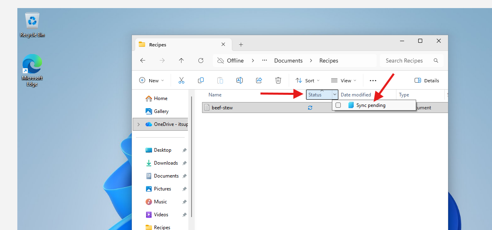
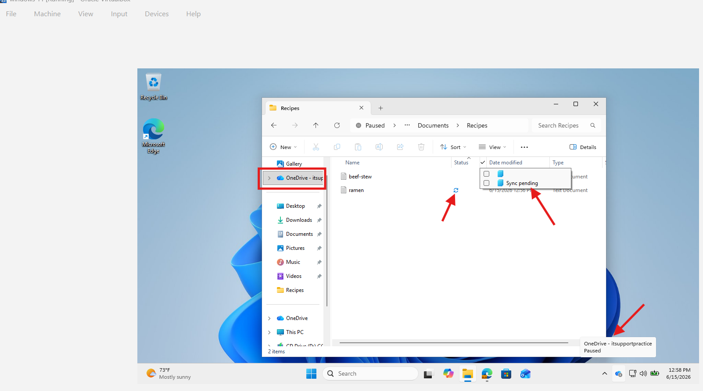

# Microsoft 365 Help Desk Ticket: OneDrive Not Syncing Files

## Ticket Summary

**Issue:** OneDrive is not syncing files between the user's computer and Microsoft 365.

**User Complaint:**

> "My OneDrive files are not showing up on my computer, and files I save locally are not appearing online."

**Service:** Microsoft OneDrive for Business
**Environment:** Microsoft 365 / Windows 10 or Windows 11
**Ticket Type:** File Sync / Cloud Storage Issue
**Priority:** Medium

---

## 1. Gather Information from the User

Before making changes, ask the user a few questions to understand the issue.

### Questions to Ask

* When did the sync issue start?
* Are all files not syncing, or only certain files?
* Are you seeing any OneDrive error messages?
* Can you access the files from OneDrive online?
* Are you connected to the internet?
* Did you recently change your password?
* Did you recently rename, move, or delete any folders?
* Are you using a work/school account or personal Microsoft account?

---

## 2. Confirm the User Can Access OneDrive Online

1. Have the user open a browser.
2. Go to:

```text
https://www.office.com
```

3. Sign in with the Microsoft 365 work or school account.
4. Open **OneDrive**.
5. Confirm whether the missing files appear online.

### Expected Result

If the files appear online, the issue is likely with the local OneDrive sync client.

If the files do not appear online, the files may not have uploaded successfully or may have been deleted/moved.

---

## 3. Check the OneDrive Sync Status

1. On the user's Windows computer, look in the bottom-right system tray.
2. Click the **OneDrive cloud icon**.
3. Review the sync status.

### Common Status Messages

* **Up to date**
* **Syncing files**
* **Sync paused**
* **Sign in**
* **OneDrive isn't connected**
* **Processing changes**
* **Sync error**

---

## 4. Resume Sync if OneDrive Is Paused

If OneDrive syncing is paused:

1. Click the **OneDrive cloud icon**.
2. Click the **gear icon**.
3. Select **Resume syncing**.
4. Wait a few minutes.
5. Check if files begin syncing again.

### Expected Result

OneDrive should start syncing files again.

---

## 5. Verify the User Is Signed Into the Correct Account

1. Click the **OneDrive cloud icon**.
2. Click the **gear icon**.
3. Select **Settings**.
4. Go to the **Account** tab.
5. Confirm the signed-in account matches the user's Microsoft 365 work account.

### If the Wrong Account Is Signed In

1. Click **Unlink this PC**.
2. Sign in again using the correct work or school account.
3. Choose the correct OneDrive folder location.
4. Allow OneDrive to resync.

---

## 6. Check for Sync Errors

1. Click the **OneDrive cloud icon**.
2. Look for any files with errors.
3. Review the error message.

### Common Causes of Sync Errors

* Invalid file name characters
* File path too long
* File is open in another program
* Not enough storage space
* No permission to access a shared file
* OneDrive account is not signed in

### Invalid Characters to Check For

Avoid using these characters in file names:

```text
" * : < > ? / \ |
```

Rename the file if needed, then allow OneDrive to sync again.

---

## 7. Restart OneDrive

Restarting OneDrive can fix temporary sync issues.

1. Click the **OneDrive cloud icon**.
2. Click the **gear icon**.
3. Select **Quit OneDrive**.
4. Open the Start Menu.
5. Search for **OneDrive**.
6. Open OneDrive again.
7. Check if syncing resumes.

---

## 8. Restart the Computer

If restarting OneDrive does not fix the issue:

1. Save any open work.
2. Restart the computer.
3. Log back in.
4. Check the OneDrive sync status again.

---

## 9. Check Available Storage

Check both local storage and OneDrive cloud storage.

### Check Local Disk Space

1. Open **File Explorer**.
2. Click **This PC**.
3. Check available space on the C: drive.

### Check OneDrive Storage

1. Go to OneDrive online.
2. Click the **settings gear**.
3. Check storage usage.

If storage is full, delete unnecessary files or empty the recycle bin.

---

## 10. Reset OneDrive

If the issue still continues, reset the OneDrive sync client.

1. Press:

```text
Windows Key + R
```

2. Run this command:

```text
%localappdata%\Microsoft\OneDrive\onedrive.exe /reset
```

3. Wait a few minutes.
4. If OneDrive does not reopen automatically, run:

```text
%localappdata%\Microsoft\OneDrive\onedrive.exe
```

5. Sign in again if prompted.
6. Confirm files begin syncing.

---

## 11. Verify the Fix

After troubleshooting, confirm the issue is resolved.

### Verification Steps

1. Create a test file in the local OneDrive folder.
2. Wait for the sync icon to show complete.
3. Open OneDrive online.
4. Confirm the test file appears online.
5. Create another test file online.
6. Confirm it appears on the local computer.

---

## 12. Document the Resolution

### Example Ticket Notes

```text
User reported OneDrive files were not syncing between their Windows computer and Microsoft 365.

Confirmed user could access OneDrive online. Checked the local OneDrive client and found sync was paused. Resumed syncing and verified the user was signed into the correct Microsoft 365 account. Created a test file locally and confirmed it appeared in OneDrive online. Created a second test file online and confirmed it synced to the local computer.

Issue resolved.
```

---

## Final Resolution

OneDrive syncing was restored by checking the sync client status, confirming the correct account was signed in, resolving sync errors, and verifying file upload/download behavior between the local computer and OneDrive online.

---

## Skills Demonstrated

* Microsoft 365 troubleshooting
* OneDrive for Business support
* Windows 10/11 user support
* Cloud file sync troubleshooting
* End-user communication
* Help desk ticket documentation

