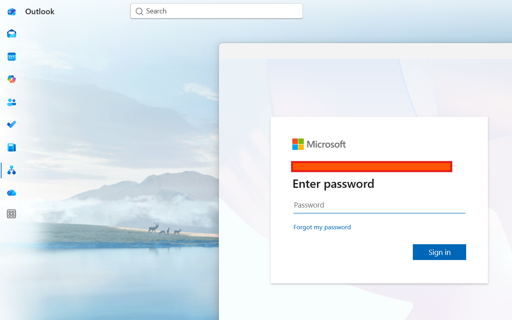

# Outlook Keeps Requesting Credentials (MFA Loop) - Troubleshooting Guide

## Overview

This guide documents the troubleshooting process for resolving an issue where Microsoft Outlook continuously prompts a user for credentials and Multi-Factor Authentication (MFA), even after successful authentication.

---

## Ticket Information

### User Report

> Outlook keeps asking me to sign in. I enter my password and approve MFA, but the sign-in window keeps coming back. I am unable to access my email.

---

# Step 1 - Gather Information from the User

Before making any changes, collect information to narrow down the scope of the issue.

### Questions to Ask

#### Issue Details

* When did the problem begin?
* Did the issue start suddenly or after a specific change?
* Are you receiving any error messages?
* Does Outlook ever successfully connect?

#### Authentication Questions

* Have you recently changed your password?
* Have you recently enrolled in MFA or changed your MFA method?
* Did you receive a new phone or reinstall Microsoft Authenticator?

#### Scope of Impact

* Are other Office applications affected?
* Can you sign in to Outlook on the Web (OWA)?
* Are you able to access Teams or OneDrive?

#### Device Information

* What version of Windows are you using?
* Are you working from a company device or personal device?
* Are you connected to VPN?

### Information Gathered

Example findings:

| Question                   | Response                             |
| -------------------------- | ------------------------------------ |
| When did issue start?      | This morning                         |
| Recent password change?    | Yes                                  |
| MFA recently changed?      | No                                   |
| Can access Outlook Web?    | Yes                                  |
| Other Office apps working? | Yes                                  |
| Error message?             | Outlook keeps requesting credentials |

### Initial Assessment

Because:

* Outlook Web works
* MFA succeeds
* Only Outlook Desktop is affected

The issue likely resides on the local workstation rather than Microsoft 365 services.

---

# Step 2 - Verify Account Status

Sign in to Microsoft 365 Admin Center.

Navigate to:

```text
Users → Active Users
```

Verify:

* User account is enabled.
* Appropriate license is assigned.
* Exchange Online is enabled.
* MFA status is healthy.

---

# Step 3 - Test Outlook Web Access

Ask the user to sign in to:

```text
https://outlook.office.com
```

Verify:

* Mailbox opens successfully.
* User can send email.
* User can receive email.

### Result

If Outlook Web functions normally while Outlook Desktop fails, focus troubleshooting on the workstation.

---

# Step 4 - Close Outlook

Completely close Outlook.

Open Task Manager:

```text
Ctrl + Shift + Esc
```

End any remaining:

```text
OUTLOOK.EXE
```

processes.

---

# Step 5 - Remove Cached Credentials

Open:

```text
Control Panel → Credential Manager
```

Select:

```text
Windows Credentials
```

Remove credentials associated with:

```text
MicrosoftOffice
Office16
MSOID
ADAL
Outlook
Microsoft365
```

---

# Step 6 - Sign Out of Office Applications

Open any Office application.

Navigate to:

```text
File → Account
```

Select:

```text
Sign Out
```

for all connected accounts.

---

# Step 7 - Restart Outlook

Launch Outlook again.

When prompted:

1. Enter Microsoft 365 credentials.
2. Complete MFA verification.
3. Allow mailbox synchronization to complete.

---

# Step 8 - Verify Resolution

Confirm:

* Inbox loads successfully.
* New mail is received.
* Test message sends successfully.
* Credential prompts no longer appear.

---

# Root Cause

The issue was caused by outdated authentication tokens and cached credentials stored on the workstation.

Following a password reset or account session refresh, Outlook attempted to use invalid authentication information. This created a loop where Outlook repeatedly requested credentials despite successful MFA verification.

---

# Resolution

The issue was resolved by:

1. Removing cached credentials from Credential Manager.
2. Signing out of Office applications.
3. Restarting Outlook.
4. Re-authenticating with Microsoft 365 and MFA.

After refreshing authentication tokens, Outlook successfully connected to Exchange Online.

---

# Skills Demonstrated

* User Interviewing and Ticket Intake
* Microsoft 365 Administration
* Exchange Online Troubleshooting
* Outlook Desktop Support
* MFA Administration
* Credential Manager Usage
* Authentication Troubleshooting
* Root Cause Analysis
* Help Desk Documentation

