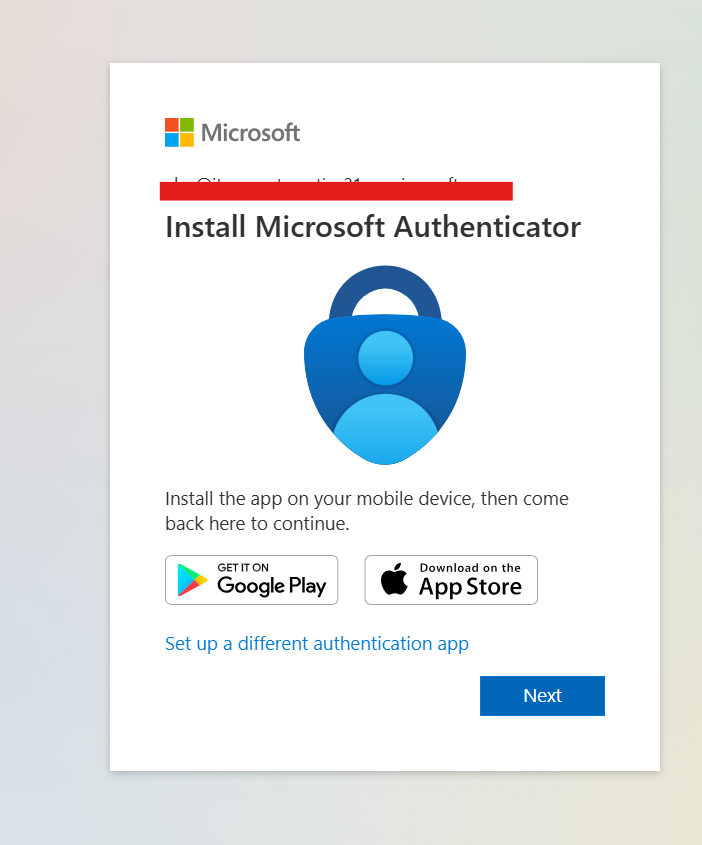

# Microsoft Outlook Troubleshooting Guides

## Overview

This folder contains a collection of Microsoft Outlook troubleshooting guides based on common Help Desk and IT Support ticket scenarios. Each guide follows a structured troubleshooting methodology used in real-world enterprise environments, including:

* User interview and information gathering
* Initial assessment
* Microsoft 365 and Exchange Online verification
* Step-by-step troubleshooting procedures
* Root cause analysis
* Resolution documentation
* Skills demonstrated

These guides are designed to simulate the types of tickets commonly handled by Level 1 and Level 2 Help Desk technicians supporting Microsoft 365 environments.

---

## Topics Covered

### Outlook Crashing / Corrupted Profile

This guide covers troubleshooting Outlook crashes, startup failures, freezing, and profile corruption issues that prevent users from accessing their mailbox.

---

### Outlook Not Sending Emails

This guide focuses on diagnosing situations where users can receive email but are unable to send messages from Outlook.

---

### Outlook Not Receiving Emails

This guide covers troubleshooting incoming email delivery issues, synchronization problems, and mailbox-related concerns that prevent users from receiving new messages.

---

### Shared Mailbox Access Issues

This guide explains how to diagnose and resolve problems related to shared mailbox access, visibility, permissions, and functionality within Outlook and Microsoft 365.

---

### MFA Authentication Loops

This guide focuses on situations where Outlook repeatedly requests credentials and MFA approval, preventing users from successfully accessing their mailbox.

---

## Skills Demonstrated

The guides in this folder demonstrate practical skills commonly used by Help Desk and Desktop Support professionals:

* Microsoft 365 Administration
* Exchange Online Administration
* Microsoft Outlook Support
* User Account Troubleshooting
* Authentication and MFA Support
* Shared Mailbox Management
* Mail Flow Troubleshooting
* User Interviewing and Ticket Intake
* Root Cause Analysis
* Technical Documentation

---

## Purpose

The purpose of this folder is to document hands-on troubleshooting scenarios that can be recreated in a Microsoft 365 lab environment. These guides serve as both a learning resource and a demonstration of practical IT support skills relevant to Help Desk, Desktop Support, and Microsoft 365 administration roles.

---

**Technology Focus:** Microsoft Outlook, Microsoft 365, Exchange Online, Microsoft Entra ID

**Category:** Help Desk, Desktop Support, Microsoft 365 Administration

