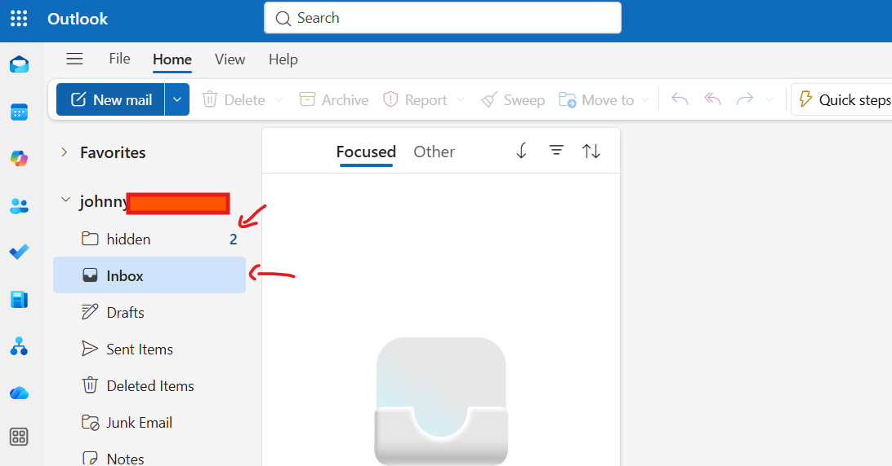

# Troubleshooting Outlook Not Receiving Emails

## Overview

This guide walks through how to troubleshoot a common Microsoft 365 help desk ticket where a user reports that Outlook is not receiving new emails.

### Common User Complaint

> "My Outlook isn't receiving emails."

This issue can be caused by mailbox sync problems, inbox rules, filtering, licensing issues, or Outlook client problems.

The goal is to determine:

* Is mail being delivered to the mailbox?
* Is Outlook syncing correctly?
* Is mail being redirected or hidden?
* Is the issue mailbox-side or client-side?

---

# Troubleshooting Steps

---

## 1. Gather Information from the User

Before making changes, collect basic details.

Ask:

* When did the issue start?
* Are **all** emails missing or only some?
* Can they send email?
* Are they using:

  * Outlook Desktop?
  * Outlook Web?
  * Mobile app?
* Are other users affected?
* Are they receiving bounce-back messages?

---

## 2. Confirm Mailbox Is Licensed and Active

Open Microsoft 365 Admin Center:

**Users → Active users → Select user**

Verify:

* User account is active
* User has license assigned
* Exchange Online is enabled

If Exchange license is missing, mailbox mail flow may fail.

---

## 3. Test Mail Delivery

Send a test email to the affected mailbox.

Example:

**Subject:** Test Email
**Body:** Testing mail delivery

---

## 4. Check Outlook Web App First

Sign into:

`https://outlook.office.com`

Check whether the email appears.

---

### If email appears in Outlook Web:

Mailbox is working.

Issue is likely:

* Outlook desktop client
* cached credentials
* sync issue
* local Outlook profile problem

---

### If email does NOT appear in Outlook Web:

Investigate:

* inbox rules
* mail flow
* junk filtering
* forwarding
* mailbox configuration

---

## 5. Check Inbox Rules

In Outlook Web:

**Settings → Mail → Rules**

Look for rules that:

* Move email
* Delete email
* Forward email
* Redirect email

Disable suspicious rules and test again.

---

## 6. Check Junk, Archive, and Other Folders

Review:

* Inbox
* Junk Email
* Archive
* Deleted Items
* Focused / Other Inbox
* Custom folders

Sometimes mail is delivered successfully but sorted into another location.

---

## 7. Troubleshoot Outlook Desktop App (If Web Mail Works)

If mail arrives in Outlook Web but not desktop:

Try:

### Restart Outlook

Close Outlook fully and reopen.

---

### Update Folder

Inside Outlook:

**Send/Receive → Update Folder**

or:

**Send/Receive All Folders**

---

### Sign Out / Sign Back In

Remove and reauthenticate the account.

---

### Rebuild Outlook Profile

If still failing:

**Control Panel → Mail → Show Profiles**

Create new profile and test.

---

## 8. Check Mail Forwarding

In Exchange Admin Center or Outlook settings, verify mail is not forwarding elsewhere unexpectedly.

---

## 9. Confirm Issue Is Resolved

Send final test email.

Verify user receives message successfully.

Confirm:

* email arrives in Inbox
* Outlook syncs normally
* user can open and reply

---

# Resolution Notes Example

```text id="p2zh0s"
User reported Outlook not receiving emails.

Verified Microsoft 365 user account was active and licensed.

Sent test email to mailbox.

Confirmed email delivery through Outlook Web App.

Reviewed inbox rules and found mail being redirected to another folder.

Disabled rule and sent additional test email.

User confirmed emails are now arriving normally in Inbox.

Issue resolved.
```

---

# Common Causes

Most common causes of "Outlook not receiving emails":

* Inbox rule moving messages
* Outlook client not syncing
* Mail routed to Junk or Archive
* Cached Outlook profile issue
* Forwarding enabled
* License issue
* Mailbox storage full
* Temporary Outlook service issue

---

# Notes

Best practice:

Start by determining:

**Mailbox issue?**
or
**Outlook client issue?**

Checking Outlook on the web early helps narrow this down quickly and saves troubleshooting time.

